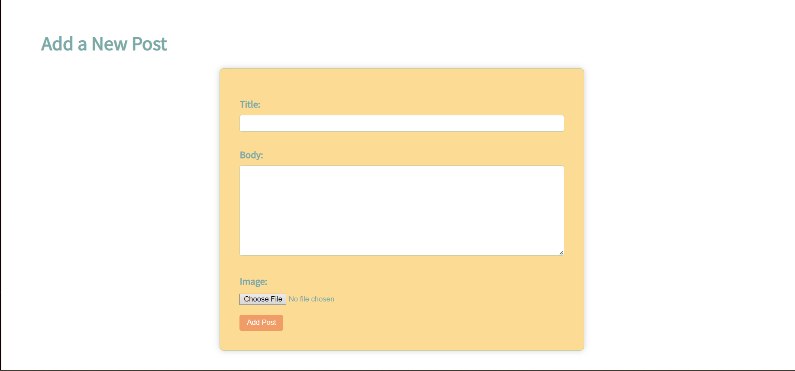
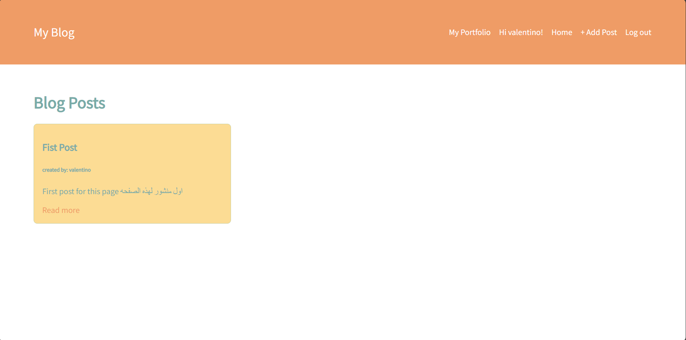
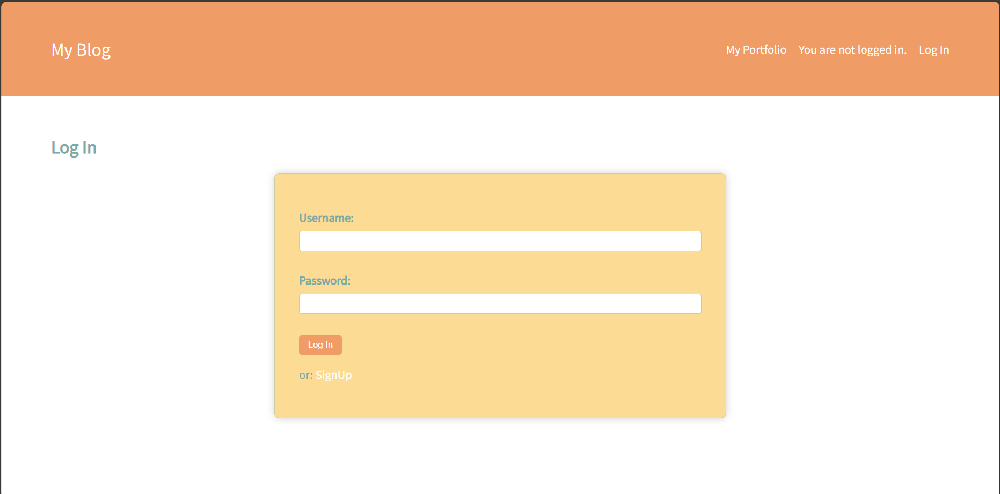
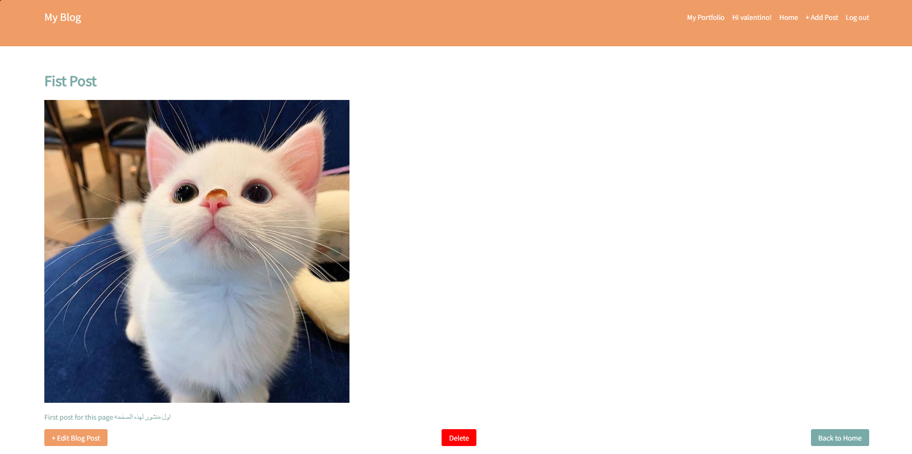

# My Blog Django Project

## Overview
  
  

  

This project is a Django-based web application for managing blog posts. Users can create, view, edit, and delete blog posts. The application includes features such as user authentication, post creation, post listing, post details, and post editing.

## Distinctiveness and Complexity

### Distinctiveness

This project satisfies the distinctiveness requirement by implementing custom features and functionalities beyond basic CRUD operations. Some distinctive features include:

- User authentication: Users can register, log in, and log out securely.
- Profile management: Users can view and update their profiles, including their usernames and passwords.
- Image upload: Users can upload images to accompany their blog posts.
- Favorite posts: Users can mark posts as favorites and view their favorite posts in a dedicated section.

### Complexity

The project demonstrates complexity through several aspects:

- Custom user model: The project uses a custom user model to extend the functionality of the built-in User model provided by Django.
- Class-based views: Views are implemented using Django's class-based views for better code organization and reusability.
- Frontend design: The project includes custom styling using CSS to improve the user interface and user experience.
- JavaScript integration: JavaScript is used to enhance interactivity, such as making images responsive and handling favorite post actions asynchronously.

## Files and Components

- **blog/models.py**: Defines the database models for blog posts and user profiles.
- **blog/views.py**: Contains the view logic for rendering templates and handling user requests.
- **blog/forms.py**: Defines forms for user authentication, post creation, and profile updating.
- **blog/urls.py**: Maps URL patterns to view functions.
- **blog/templates/**: Contains HTML templates for rendering the user interface.
- **static/css/**: Contains custom CSS stylesheets for styling the frontend.
- **static/js/**: Contains JavaScript files for enhancing interactivity.

## How to Run

To run the application locally, follow these steps:

1. Clone the repository to your local machine.
2. Navigate to the project directory.
3. Create a virtual environment and activate it.
4. Install the required Python packages using `pip install -r requirements.txt`.
5. Apply migrations to create the database schema: `python manage.py migrate`.
6. Run the development server: `python manage.py runserver`.
7. Access the application in your web browser at `http://localhost:8000`.

## Additional Information

- This project was developed as part of a Django web development course.
- For any issues or suggestions, please contact [project@example.com](mailto:project@example.com).

---

### requirements.txt
- Django~=3.2.10
- mysqlclient
- Pillow